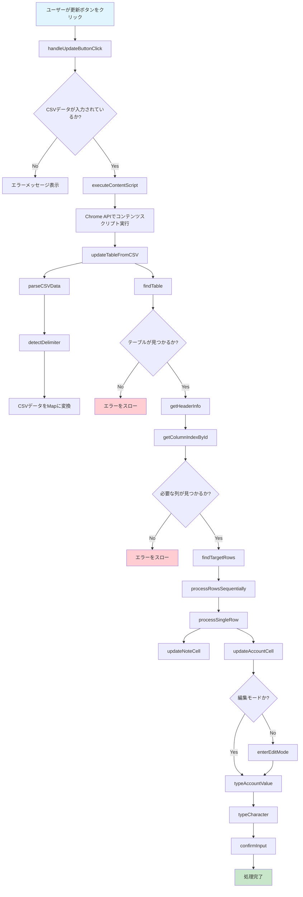
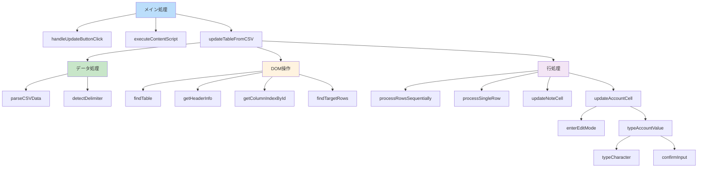
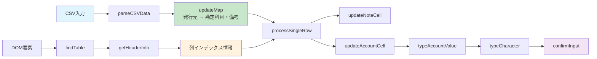
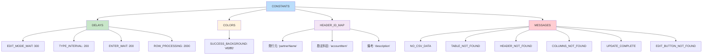
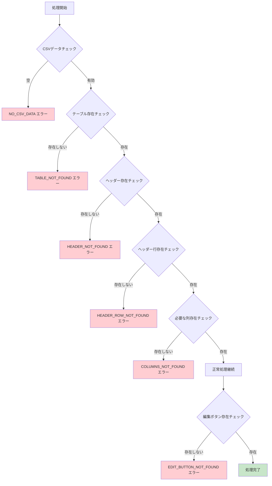
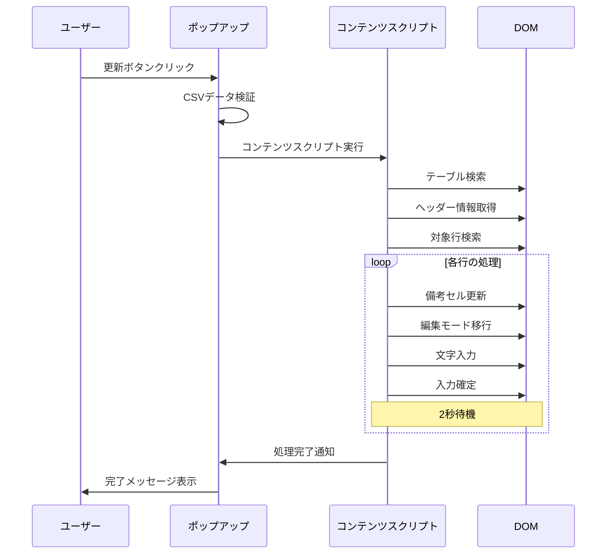

# TableRule Import 拡張機能 - アーキテクチャ図

## 処理フロー図

## 関数階層図

## データフロー図

## 定数構造図

## エラーハンドリング図

## タイミング図

## 主要な改善点

### 1. **モジュール化**
- 単一責任の原則に従った関数分割
- 再利用可能なコンポーネント設計

### 2. **エラーハンドリング**
- 包括的なエラー検出と処理
- ユーザーフレンドリーなエラーメッセージ

### 3. **設定管理**
- 定数による設定の一元管理
- メンテナンス性の向上

### 4. **非同期処理**
- 順次処理による安定性確保
- 適切なタイミング制御

### 5. **可読性**
- 明確な関数名とコメント
- 論理的な処理フロー
