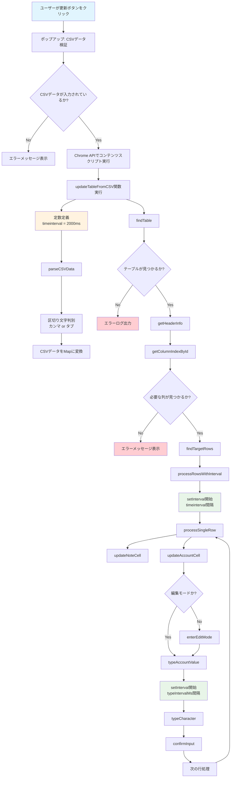
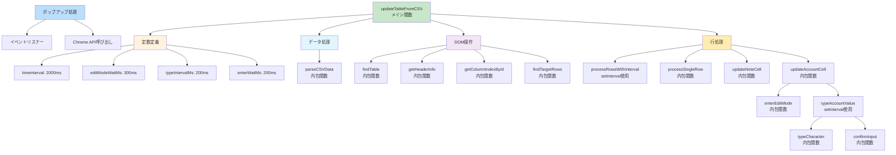
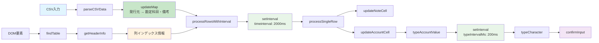
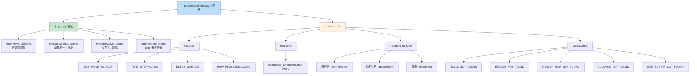
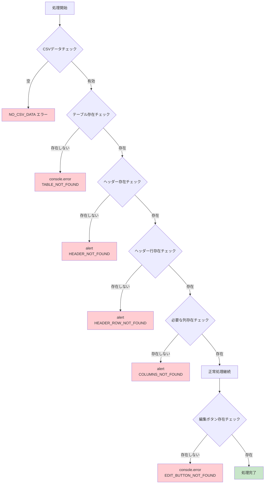
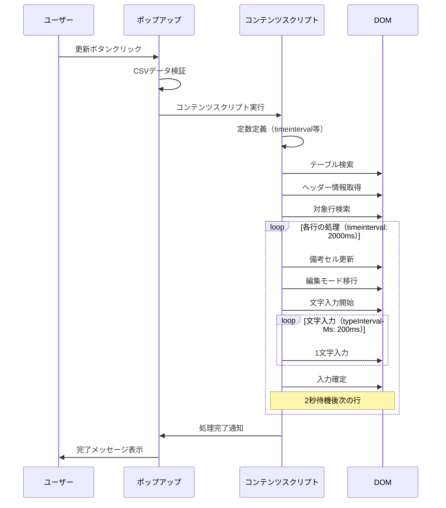
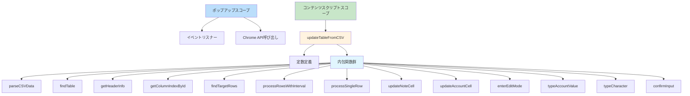

# TableRule Import 拡張機能 - アーキテクチャ図（更新版）

## 処理フロー図

## 関数階層図（更新版）

## データフロー図（更新版）

## 定数構造図（更新版）

## エラーハンドリング図（更新版）

## タイミング図（更新版）

## スコープ構造図

## 主要な改善点（更新版）

### 1. **スコープ問題の解決**
- すべての依存関数を`updateTableFromCSV`内に内包
- コンテンツスクリプトの実行環境で確実に動作

### 2. **setIntervalベースの処理**
- 行処理: `timeinterval = 2000ms`で順次実行
- 文字入力: `typeIntervalMs = 200ms`で1文字ずつ入力

### 3. **タイミング制御の改善**
- 編集モード待機: `editModeWaitMs = 300ms`
- Enter確定待機: `enterWaitMs = 200ms`

### 4. **エラーハンドリング**
- 適切なエラーメッセージ表示
- 処理の継続性を保証

### 5. **保守性の向上**
- 定数の一元管理
- 明確な関数責任分離
- 読みやすいコード構造
